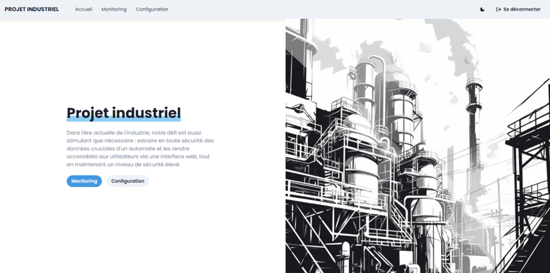

# Projet Industriel - Application Web de Surveillance d'Automate

Bienvenue dans le repository de notre projet industriel, une application web conçue pour extraire les données d'un automate industriel de manière sécurisée et les rendre accessibles via une interface web conviviale.

## Auteurs
Ce projet a été réalisé dans le cadre du cours de projet industriel en collaboration avec les membres suivants :
- Jérôme
- Steven
- Antoine

## Contexte
Le travail a été effectué à Technocampus à Mons, en particulier dans la mini-usine 4. Nous avons effectué cinq visites pour comprendre les besoins spécifiques et mener à bien notre mission.

## Infrastructure
Pour garantir une connexion sécurisée entre l'automate et le site, nous avons intégré l'Ewon Flexy 203, un routeur industriel performant. Ce composant a été configuré pour établir un tunnel VPN, renforçant ainsi la sécurité de la communication entre l'automate et le serveur. L'accès aux fonctionnalités avancées du site nécessite une identification, ajoutant une couche supplémentaire de sécurité.

## Fonctionnalités
À partir de l'interface web que nous avons développée, les utilisateurs peuvent :
- Surveiller les capteurs détectant des événements spécifiques.
- Actionner une lampe et sélectionner la couleur souhaitée.

## Approche
Ce projet a exigé une approche méticuleuse pour concilier la complexité des systèmes industriels avec une expérience utilisateur optimale. La sécurité des communications a été notre priorité, et nous avons mis en œuvre des mesures telles qu'un tunnel VPN pour garantir une communication sécurisée.

## Remerciements
Nous tenons à remercier Technocampus pour l'accès à leurs installations et l'opportunité de travailler sur ce projet industriel passionnant.
Nous tenons également à remercier notre professeur, B. Michaux, pour son soutien et ses conseils tout au long du projet ainsi que notre accompagnateur sur place, M. Xavier, pour son aide et ses conseils.
